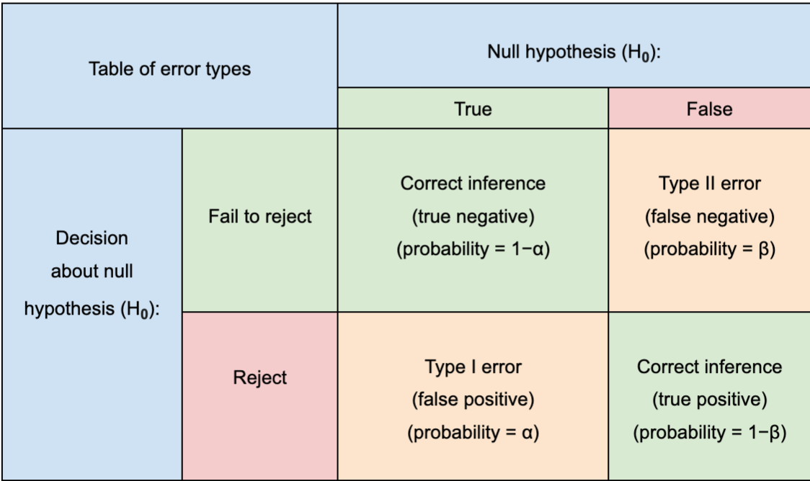

# Analytics

[TOC]

## Types of Analytics

This page is actually for all different types of analytics that may own a
different title: analytics, business/decision intelligence, data science,
statistics, data mining, information science, etc.

The goal is to use information to solve problems and make better decisions for
improved outcomes and efficiency.

### Descriptive

Descriptive analytics looks at data statistically to tell what happened in the
past. It helps a business understand how it is performing by providing context
to help stakeholders interpret information. It can be done in real-time too with
data visualizations and reports in dashboards.

### Diagnostics

Diagnostic analytics provides deeper analysis to answer the question: Why did
this happen? This includes using processes such as data discovery (self-serve),
data mining, and drill down and drill through. Often referred to as root cause
analysis.

### Predictive

Predictive analytics takes historical data and feeds it into a machine learning
model (or other forecasting methods) that considers key trends and patterns. The
model is then applied to current data to predict what will happen next.

### Prescriptive

Prescriptive analytics suggests various courses of action and outlines what the
potential implications would be for each based on the likelihood of an event
happening in the future.

## Statistics

### Error Measurement

<section class="tabs">

#### Type I {.new-tab}

Type I error occurs when a true null hypothesis is rejected even though there is
no effect. - A “false positive". - Example: "an innocent person is convicted".

#### Type II {.new-tab}

A Type II error occurs when the alternative hypothesis is correct, but you fail
to reject the null hypothesis (in other words, there really is an effect, but
you failed to detect it).

#### Type III {.new-tab}

What’s a Type III error? Jokingly, correctly rejecting the wrong null
hypothesis. In other words, using all the right math to answer the wrong
question.

</section>

### Power Analysis

Should an effect be real, power is the probability of detecting it, i.e. the
probability of rejecting the null hypothesis when its in fact false.

If we run an experiment many times, a power of 0.8 concludes that 80% of the
time we get a statistically significant difference between the treatment and the
control. We want to do this before conducting an experiment to justify the cost
and to help frame the questions before data collection as a good practice.

It would not be good to find the minimum subjects needed for an experiment.
Power analyses do no generalize well. Changing data collection methods or the
statistical procedure will require a new analysis. It gives a best case scenario
estimate of the needed subjects to detect an effect, and is based on assumptions
and educated guesses. If any of the assumptions are incorrect, you can have less
power than estimated. Having a range of standard deviations can be more useful.

An effect size is the difference of two group means divided by the
pooled standard deviation. Its possible to have an effect size that is small
with a power of 0.9, but that may not translate to a “clinically relevant”
effect which is helpful to the business.

#### Resources

-   Power Analysis
    -   [UCLA Stats Consult (Intro to Power Analysis)](https://stats.idre.ucla.edu/other/mult-pkg/seminars/intro-power/)
    -   [Stats Teacher - What is Power?](https://www.statisticsteacher.org/2017/09/15/what-is-power/)
    -   [Monte Carlo Power Analysis](https://deliveroo.engineering/2018/12/07/monte-carlo-power-analysis.html)
    -   [Russian Textbook PA](http://statsoft.ru/home/textbook/modules/stpowan.html)
