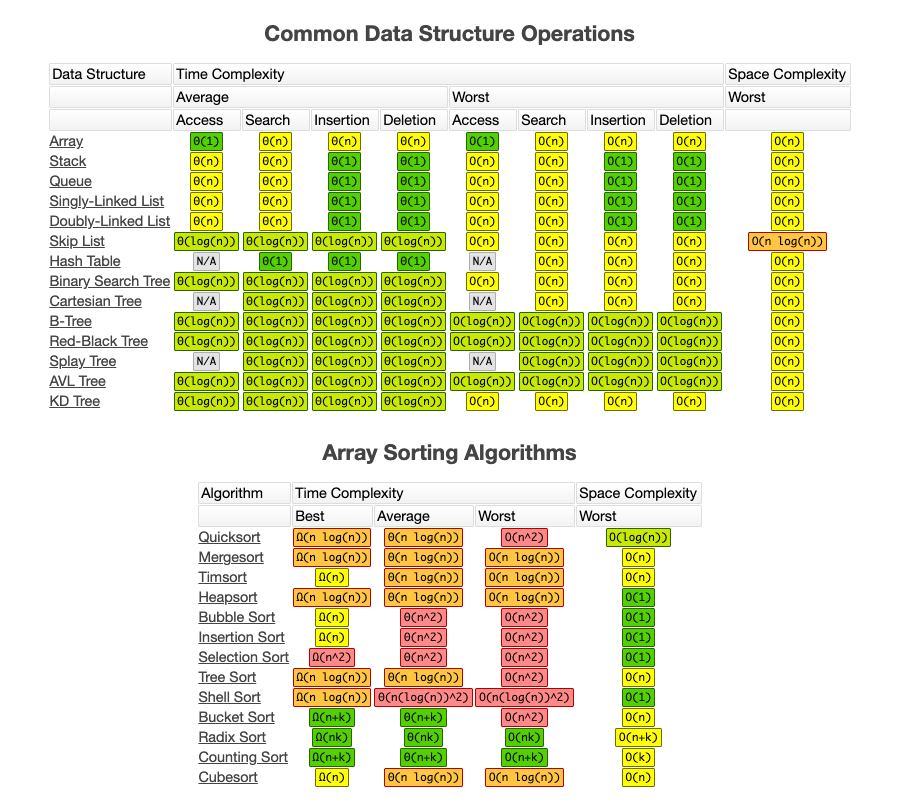

# Data Engineering Stuff

[TOC]

## Philosophies

<section class="tabs">

#### From Ashish Mrig @ Wayfair {.new-tab}

[Design & Strategies](https://mrashish.medium.com/design-strategies-for-building-big-data-pipelines-4c11affd47f3)

Above all, trust is the main factor for good data engineering. If users cannot
trust the data the following do not matter.

Quality        | Principles
-------------- | -------------------------------------------------------------
Scalable       | Always prepare to grow new business without disruption.
Performant     | Access and queryability is efficient and timely.
Maintainable   | Infrastructure should be easy to maintain and upgrade.
Reproducible   | Stakeholders should be able to review data without silos.
Adaptable      | Expect the unexpected, plan for revisability and flexibility.
Comprehensible | Standardization to help new contributors pick up the product.
Detectable     | Information should be monitored for quality / errors.

Bonus:

-   Less code is better, as is complexity.
-   Metadata driven modeling will help create flexible data pipelines.
-   Design & simplify before construction.

#### Panoply Whitepaper {.new-tab}

[Data Engineering History](https://learn.panoply.io/hubfs/Data%20Engineering%20-%20Introduction%20and%20Epochs.pdf)

Big data accounts for these characteristics and whould always be at the
forefront of decisions when designing, building, or enhancing large scale
systems.

| Quality       | Principles                                                   |
| ------------- | ------------------------------------------------------------ |
| Volume        | More and more data will always be available, wrangle         |
:               : carefully.                                                   :
| Velocity      | Faster data processing and analysis for utility.             |
| Variety       | Data may be unstructured and suddenly require large changes. |
| Variability   | Assign consistent meaning to data over time as other         |
:               : business evolves.                                            :
| Veracity      | Trusting the data is a priority e.g. garbage in, garbage     |
:               : out.                                                         :
| Visualization | Make data easy to understand and digest.                     |
| Value         | Connect data to purpose for ROI e.g. streamline processes or |
:               : reduce costs.                                                :

</section>

## OLAP vs OLTP

<section class="tabs">

#### Online Analytical Processing (OLAP) {.new-tab}

Databases optimized for these workloads allow for complex analytical and ad hoc
queries, including aggregations. These type of databases are optimized for reads
of Historical Data or Archival Data and has response time as an effectiveness
measure. They have relatively low volume of transactions against
multi-dimensional (star) schemas.

Textbook definitions of a Data Warehouse (DWH):

-   A data warehouse is a copy of transaction data specifically structured for
    query and analysis (Kimball).
-   A data warehouse is a subject-oriented, integrated, nonvolatile, and
    time-variant collection of data in support of management's decisions
    (Inmon).
-   A data warehouse is a system that retrieves and consolidates data
    periodically from the source systems into a dimensisional or normalized data
    store. It usually keeps years of history and is queried for business
    intelligence or other analytical activities. It is typically updated in
    batches, not every time a transaction happens in the source system
    (Rainardi).

#### Online Transactional Processing (OLTP) {.new-tab}

Databases optimized for these workloads allow for less complex queries in large
volume for operational purposes. Allows for fast query processing of many short
on-line transactions (INSERT, UPDATE, DELETE) that can maintain data integrity
in multi-access environments. Usually enables a 3NF model. Effectiveness is
measured by number of transactions per second.

</section>

## Relational Database

Edgar R. Codd invented relational databases in 1969 at IBM. These
[12 Rules](https://www.tutorialspoint.com/dbms/dbms_codds_rules.htm) help define
relational databases.

Old RDBMS was insufficient for modern large data demands, so Massively Parallel
Processing (MPP*) on columnar-based storage helped keep RDBMS competitive. The
idea behind columnar is the data is stored in column blocks rather than blocks
of rows, thus gaining efficiencies when optimizing IO with consistent column
types which were better compressed, and not having to access unnecessary data.

MPP* uses mini compute units with own CPU/Memory/Disk, e.g. Redshift/Teradata.

<section class="tabs">

#### Advantages {.new-tab}

-   Flexibility for writing in SQL queries.
    -   Ability to do JOINS.
    -   Ability to do aggregations and analytics.
-   Modeling the data not modeling queries.
-   Secondary Indexes available: You have the advantage of being able to add
    another index to help with quick searching.
-   Smaller data volumes: If you have a smaller data volume (and not big data)
    you can use a relational database for its simplicity.
-   ACID Transactions: Allows you to meet a set of properties of database
    transactions intended to guarantee validity even in the event of errors,
    power failures, and thus maintain data integrity.
-   Easier to change to business requirements.

#### Disadvantages {.new-tab}

-   Centralized databases and vertical scaling by adding more storage in the
    machine itself rather than more machines.
-   Sorting different data type formats: Relational databases are not designed
    to handle unstructured data.
-   Low throughput / slow reads: While ACID transactions bring benefits, they
    also slow down the process of reading and writing data.
    -   Queries off disk and in memory buffers are slow.
-   Intransigent/inflexible schema.
-   Low availability: Relational databases are centralized (or are distributed
    and have a coordinator/worker architecture), they have a single point of
    failure. When that database goes down, a fail-over to a backup system occurs
    and takes time.
-   No horizontal scalability, has no ability to add more machines or nodes to a
    system to increase performance and space for data.

</section>

### Normalization vs. Denormalization

<section class="tabs">

#### Normalization {.new-tab}

Benefits:

-   Reduces data redundancy. Concepts are isolated.
-   Increases data integrity (less copies to deal with).
-   Less insertions updates and deletion dependencies.
-   Less refactoring as new types of data are introduced.
-   More informative and intuitive to users.
-   Makes the database neutral to the query statistics.

<section class="tabs">

##### First Normal Form {.new-tab}

-   Atomic values: each cell contains unique and single values (No sets,
    collections, or lists in any column).
-   Be able to add data without altering tables (no new columns).
-   Separate different unique relations into different tables, even though they
    can be grouped by a common key.
-   Keep relationships between tables together with foreign keys.

##### Second Normal Form {.new-tab}

-   Must have reached 1NF.
-   All columns in the table rely on the Primary key. No composite keys
    (Shouldnt need 2 elementes ot get a third).

NOTE: A composite key is a candidate key that consists of two or more attributes
(table columns) that together uniquely identify an entity occurrence (table
row). A compound key is a composite key for which each attribute that makes up
the key is a simple (foreign) key in its own right.

##### Third Normal Form {.new-tab}

-   Must have reached 2NF.
-   No transitive dependencies. When you want to update data, desirable to
    update in 1 place.

Beyond 3NF is rare and reserved for academic or unique applications.

</section>

#### Denormalization {.new-tab}

Once data is normalized, it can be denormalized to deliver value to users. A
facts table collects statistical measures with only foreign keys and is the
centerpiece of a star schema, a popular design for data warehouses. The foreign
keys reference dimensional tables holding metadata to enrich the facts table.

<section class="tabs">

##### Advantages {.new-tab}

-   Useful for read heavy workloads to increase performance with less joins.
-   Faster aggregations and simpler queries.

##### Disadvantages {.new-tab}

-   Worry about data integrity with duplicated information
-   Less query flexibility and ad hoc queries
-   Many to many relationships are simplified and abstracted away which may lead
    to misuse. Does not allow one to many relationships.

    </section>

A snowflake schema is a logical arrangement of tables in a multidimensional
database represented by centralized fact tables which are connected to multiple
dimensions. Its more complex than a star schema, which is the same concept but
simplified on the dimension tables. Snowflake schemas are more normalized (in
1NF or 2NF) and have extended tables beyond the first level of dimensions to
capture one to many relationships.

</section>

[Postgres](https://www.postgresql.org/about/) is an open-source
object-relational database that houses structured data reliably.

Resources:

-   [Tutorial (MacOS)](https://www.codementor.io/@engineerapart/getting-started-with-postgresql-on-mac-osx-are8jcopb)
-   [Tutorial](https://pynative.com/python-postgresql-tutorial/)
-   [Postgres Scalability Extension (Citus)](https://github.com/citusdata/)

### Database Technologies

<section class="tabs">

#### Hadoop MapReduce {.new-tab}

MapReduce was invented at Google by Jeff Dean (EID:30) and Sanjay Ghemawat (62)
to efficiently divide any work job over a cluster of compute resources. The
framework was fault tolerant of failures. Doug Cutting (Yahoo!) open sourced the
technology as Hadoop.

<section class="tabs">

##### Advantages {.new-tab}

-   Linear parellel processing of huge data sets on different data nodes.
-   In case the resulting dataset is larger than available RAM, Hadoop MapReduce
    may outperform Spark.
-   Hadoop can handle a lot of shuffling and sorting if needed in joins.
-   Economical solution, if no immediate results are expected.
-   Allows starter MPP scale instead of expensive rack appliances for vertical
    scale. Can add more compute or storage with horizontal scaling.

##### Disadvantages {.new-tab}

-   Hadoop needs a third-party to provide machine learning solutions.
-   Has to write interim results to a disk (even in parallel, its generally
    slow). Cannot do iterative processing like Spark.
-   Java based, but Facebook's Hive is a SQL interface over MR for ease of use.

YARN is Hadoop's resource manager that schedules jobs across a cluster. It keeps
track of what resources are available then assigns compute resources to tasks.

</section>

#### Spark {.new-tab}

Spark as a data processing engine brought new advantages to the market after DFS
(Distributed File System). With a SQL interface and no disk reads, the in-memory
distributed data processing technology is fast like MPP, easy like RDBMS, and
scalable like Hadoop. Impala/Presto can serve as query engines on top of Spark.

TIP: `RDD` refers to resilient distributed dataset. RDDs are Spark's way of
sotring fault-tolerant datasets distributed across a cluster.

<section class="tabs">

##### Advantages {.new-tab}

-   Fast data processing. In-memory processing makes Spark faster than Hadoop
    MapReduce – up to 100 times for data in RAM and up to 10 times for data in
    storage.
-   Iterative processing. Resilient Distributed Datasets (RDDs) enable multiple
    map operations in memory.
-   Near real-time processing.
-   Graph processing. Spark’s computational model is good for iterative
    computations that are typical in graph processing. Supports GraphX – an API
    for graph computation.
-   Spark MLlib – built-in machine learning library. MLlib has out-of-the-box
    algorithms that also run in memory.
-   Joining datasets. Spark can create all combinations faster (very large data
    probably handled in Hadoop better).

##### Disadvantages {.new-tab}

-   Installation and management of in-memory clusters and other devops tasks
    which are operationally difficult.
-   Theres a 500ms latency when streaming with micro-batches of records, instead
    of processing one record at a time.
-   Lack of native system to organize, store, and process data files (DFS).

PaaS cloud-based distributed in-memory engines (GCP/ AWS/ Azure) have answered
these operational frustrations by offering abilities cheaply to scale up or down
based on demand, distributed file storage, disaster recovery, load balancing,
automatic backups, automated maintenance, and more.

</section>

</section>

### CAP Theorem

The CAP theorem states it is impossible for a distributed data store to provide
more than 2 of these 3 following characteristics:

-   Consistency. Every read from the database gets the latest and correct piece
    of information or an error.
-   Availability. Every request is received and a response is given without a
    guarantee that the data is the latest update.
-   Partition Tolerance. The system continues to work regardless of losing
    network connectivity between nodes.

### ACID Transactions

-   Atomicity
    -   An atomic transaction is an indivisible and irreducible series of
        database operations such that either all occurs, or nothing occurs.
-   Consistency
    -   Only transactions that abide by constraints, cascades (rollbacks),
        triggers (automated procedures) and rules are written into the database,
        otherwise the database keeps the previous state.
    -   The data should be correct across all rows and tables.
-   Isolation
    -   Determines how transaction integrity is visible to other users and
        systems.
    -   Transactions are processed independently and securely.
    -   Order does not matter.
    -   A low level of isolation enables many users to access the data
        simultaneously.
        -   Increases the possibilities of concurrency effects (e.g., dirty
            reads or lost updates).
    -   A high level of isolation reduces these chances of concurrency effects.
        -   Uses more system resources and transactions may block each other.
-   Durability
    -   Completed transactions are saved to database even in cases of system
        failure.

## Non-Relational Database (NoSQL)

Resources:

-   [Install guide](https://cassandra.apache.org/doc/latest/getting_started/installing.html)

<section class="tabs">

#### Advantages {.new-tab}

NoSQL databases can be simple while offering the following benefits:

-   Handles large amounts of data.
-   Horizontal/ linear scalability, can add more nodes and servers to increase
    performance.
-   High throughput, fast reads and writes.
-   Flexible schema with masterless architecture. Allows varying columns for
    different rows. Can save disk space.
-   High availability, no downtime. There can be some node failures but there
    are many copies of the data.
-   Low latency for users that are distributed.

#### Disdvantages {.new-tab}

NoSQL should **not** be used for:

-   Small data, its possible but not designed for this.
-   A consistent database with ACID transactions (MongoDB & MarkLogic
    exceptions). Since some nodes fail and there are many copies of data, there
    may be inconsistency when pulling latest information.
-   Joining tables for quick analysis or aggregations (Full table scan?).
-   Fast changes in business requirements. Ad-hoc queries are possible but
    difficult as the data model was done to fix particular queries.
-   May require a new NoSQL language for each technology.
-   Extra step on top of application languages (Java) for performing ETL tasks.
    SQL is more mature in this manner.

</section>

### Characteristics of different NoSQL databases:

<section class="tabs">

#### Apache Cassandra {.new-tab}

-   Partition row store.
-   Tables are distributed by partitions across nodes/servers organized in
    columns/rows.
-   A Keyspace is a collection of tables. A partition is a fundamental unit of
    access and a collection of rows.
-   Highly scalable, can handle big data, high availability.
-   Optimized for heavy writes (IoT, time series, transaction logging).
    -   Clustering columns are more performant than joins. They sort partitioned
        data.
-   Denormalization is a must, modeling with queries in mind will help for fast
    reads (there are no joins!)

#### MongoDB {.new-tab}

-   Document store.
-   Key lookups, has API that retrives documents based on contents (Search).
-   Can support multi-document sharded/partitioned ACID transactions in v4.2.

#### DynamoDB {.new-tab}

-   Key:value store; represents key:value pairs.

#### Apache HBase {.new-tab}

-   Wide column store.
-   Tables store rows and columns, names and data formats can vary per row.

#### Neo4j {.new-tab}

-   Graph database.
-   Entity relationships focusing on nodes and edges.

</section>

## Data Definition Language (DDL) / Data Manipulation Language (DML)

This can apply variously to both relational and non-relational databases.

<section class="zippy" style="margin-left: 40px; border: 1px solid #ddd;">
  <h5>DDL table creation.</h5>

```SQL
CREATE TABLE IF NOT EXISTS TableName (
    primary_id INT [PRIMARY KEY],
    secondary_key TEXT [NOT NULL][UNIQUE],
    value NUMERIC,
    [PRIMARY KEY (primary_id, secondary_key), [clustering columns]
    [UNIQUE (primary_id, value)]
);
```

-   A `NOT NULL` constraint requires the field to be populated.
-   `NOT NULL` is shorthand for `CHECK (column IS NOT NULL)`. A `CHECK` is a
    constraint keyword that validates any rule which depends on the values
    within a single 'tuple'.
-   A `UNIQUE` constraint requires all values to not be a duplicate from
    another.
-   A `PRIMARY KEY` constraint is a unique identifier for rows and can not be
    null. Multiple primary keys combined are a composite key.
-   Clustering columns sorts data in ASC order for each partition.

</section>

<section class="zippy" style="margin-left: 40px; border: 1px solid #ddd;">
  <h5>DML data insertion (or upsert).</h5>

```SQL
INSERT INTO TableName (primary_id, secondary_key, value)
VALUES (4, 'KEY', 0.20)
[ON CONFLICT (primary_id, secondary_key)
DO [NOTHING|UPDATE*]
  *SET value = primary_key + value;
```

UPSERT refers to the idea of inserting a new row in an existing table, or
updating the row if it already exists in the table.

Files can be [copied](https://www.postgresql.org/docs/9.2/sql-copy.html) into a
table from a storage or into a file from a query.

```SQL
COPY TableName (column_name, ...)
    FROM { 'filename' | STDIN }
    [WITH] ( option [, ...] ) ]
```

</section>

<section class="zippy" style="margin-left: 40px; border: 1px solid #ddd;">
  <h5>DML data updates.</h5>

```SQL
UPDATE TableName T
SET T.primary_key = T.secondary_key[,
    T.secondary_key = T.primary_key]
WHERE (conditions);
```

</section>

## Validations

Common validations:

-   Process checks
    -   Counts of specific values.
    -   Duplicates on the primary key(s).
-   Functional checks
    -   Sensible numbers in context of the key / special attribute.
    -   Comparing to a known set / fact list.

## Big O Notation

 |
[source](https://www.bigocheatsheet.com/)

## Resources

-   [Design & Strategies](https://mrashish.medium.com/design-strategies-for-building-big-data-pipelines-4c11affd47f3)
-   [Star Wars SQL vs NoSQL](https://blog.timescale.com/blog/why-sql-beating-nosql-what-this-means-for-future-of-data-time-series-database-348b777b847a/)
-   [Data Engineering History](https://learn.panoply.io/hubfs/Data%20Engineering%20-%20Introduction%20and%20Epochs.pdf)
-   [Data Engineering Blog for Learning](https://www.startdataengineering.com/)
