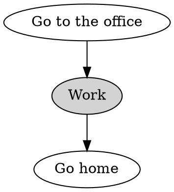
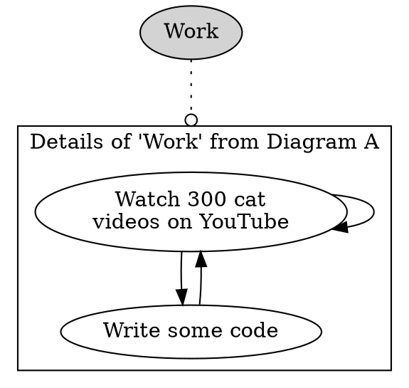
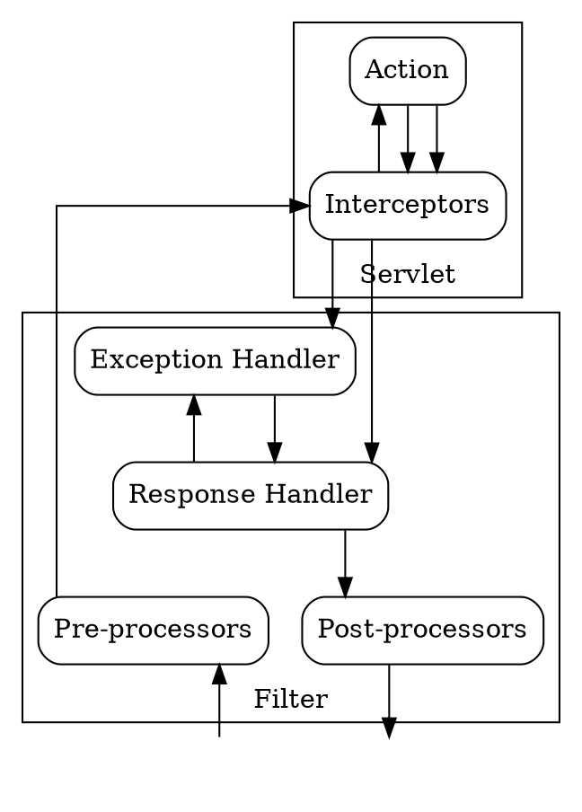

# Markdown

[TOC]

# TOOD(DCV): Add github link.
The source for this file is found at

## Double Hash (#) Heading {#custom-id}

This is a collection of markdown for quick referencing. [^1] Markdown is useful.
It helps write `HTML code` with _simplicity_. [^footnote-42]

Unfortunately, some of these features may not work outside of GitLab and without
Mermaid, or other plugins (mathjax). You can use Markdown in the following
areas:

*   Buganizer issues
*   Comments
*   Changelists in Critique (Merge requests)
*   Markdown documents inside repositories
*   Asterisks (*) helped build this list

[Gitlab Example](https://gitlab.com/gitlab-org/gitlab/blob/master/doc/user/markdown.md)

[^1]: Footnote 1 is just mentioning that I started with
    [md guide's cheat sheet](https://www.markdownguide.org/cheat-sheet/).
[^footnote-42]: Te-he.

--------------------------------------------------------------------------------

**Embolden yourself with two asterisks (*) and also knowledge!**

## Second heading with 2 hashes {#2_2hash}

Here's a ~~striking~~ly good table:

| Note                            | Example                          | Other |
| :------------------------------ | :------------------------------: | ----: |
| left justify with long 'face'   | Left justify `:---`              | Hey   |
| no mouth (colon, dash x3+)      |                                  | Ho    |
| Reverse this 'face' to right    | Right justify `---:`             | Watch |
| justify (dash x3+, colon)       | (See `Other` column ->)          | It    |
|                                 |                                  | Flow  |
| Add 2 faces together for center | Rows extend in source code to    | !     |
: justify `\:---\:`               : accomodate long texts with colon :       :
:                                 : `\:` instead of pipe `\|`        :       :

Give me a <br> (break \<br>) <br> of that Kit. Kat. Bar.

And transition line with some dashes:

--------------------------------------------------------------------------------

### Inline Media

Embed media with an exclamation! before a \[link]()


Silly video should have been embedded but its actually a link that leads to YT.
<a href="http://www.youtube.com/watch?feature=player_embedded&v=VOC3huqHrss" target="_blank">

</a>

go/links{.escaped} automatically link unless escaped with {.escaped} keyword.

### Checklist

1.  [x] Oompa loompa doompety da
1.  [ ] If you're not greedy, you will go far
    *   [ ] Im not 100% sure if all this works.
    *   [x] My github uses markdown:
        [kramdown](https://kramdown.gettalong.org/syntax.html) in YAML

### Code Blocks

Code blocks define the language after 3 backticks ` ```python`.

```json
{
  "firstName": "John",
  "lastName": "Smith",
  "age": 25
}
```

```javascript
var foo = function(bar) {
  return(bar + 5);
}
foo(3)
```

### Boxes

> Add all sorts of stuff. Boxes start with `>`.

### Notification

NOTE: **Note:** Adding a note here to tell you about notes identified by `NOTE`.

### Warning

WARNING: **Warning:** Warnings warn by using `WARNING`.

Error

> There are no error messages AFAIK, use warning.

### Tips

TIP: **Tips**: Tips tip with `TIP`.

### Important notice

IMPORTANT: **Important** messages start with `IMPORTANT`

## Diagrams / Flowcharts

# link to graphviz ref

Wrap syntax in a code-block using the dot langugage, or reference the dot file:

> \<!--#include file="relative/path/to/graph.dot"-->

# TODO(DCV): Add TIP to an example link.

--------------------------------------------------------------------------------

# link to graphviz syntax reference





--------------------------------------------------------------------------------

```dot
digraph {
  stylesheet= # Would include graphviz-style.css here.
  node [shape=box, style=rounded]
  nodesep = 0

  // Top layer
  { rank = same
    node [id=blue]
    Browser [shape=egg]
    Mobile [label="Mobile Apps", shape=egg] }

  // UI layer
  { rank = same
    node [width=1.5, id=grey]
    UI1 [label="Account Central"]
    UI2 [label="Oz"]
    node [id="dark blue"]
    UI3 [label="PhotosUi"]
    UI4 [label="TauUi"]
    UI5 [label="..."]
    UI6 [label="DataMixer API", width=1.5, id="dark green"] }

  // Data mixer layer
  DataMixer [width=9, id=orange]

  // Data server layer
  { rank = same
    node [width = 2.25, id="dark orange"]
    DS1 [label="Account Central DataServer"]
    DS2 [label="Photos DataServer"]
    DS3 [label="Stream DataServer"]
    DS4 [label="..."] }

  // Backends layer
  Backends [id="dark grey", shape=egg]

  // Edges
  Browser -> { UI1, UI2, UI3, UI4, UI5 } -> DataMixer [sametail=true]
  Mobile -> UI6 -> DataMixer
  DataMixer -> { DS1, DS2, DS3, DS4 } -> Backends [sametail=true]
}
```

--------------------------------------------------------------------------------



--------------------------------------------------------------------------------

Sequence Diagram. # link to diagrams.

```sequence-diagram
participant B
participant Class\nA as A  [fillcolor="#3369e8", fontcolor="white"]
Title: Here is a title
A->B: Normal line with `go/link` [href=" # link to sequence-diagrams"]
B-->C: Dashed line [fontcolor="red"]
C->>D: Open arrow
D-->>A: Dashed open arrow
```

## Math

# link to mathjax reference

MathJax is a JavaScript library that renders and styles mathematical expressions
in Tex/LaTex and MathML.

[Helpful Stack Exchange](https://math.meta.stackexchange.com/questions/5020/mathjax-basic-tutorial-and-quick-reference)

$$
\begin{aligned}
  & \phi(x,y) = \phi \left(\sum_{i=1}^n x_ie_i, \sum_{j=1}^n y_je_j \right)
  = \sum_{i=1}^n \sum_{j=1}^n x_i y_j \phi(e_i, e_j) = \\
  & (x_1, \ldots, x_n) \left( \begin{array}{ccc}
      \phi(e_1, e_1) & \cdots & \phi(e_1, e_n) \\
      \vdots & \ddots & \vdots \\
      \phi(e_n, e_1) & \cdots & \phi(e_n, e_n)
    \end{array} \right)
  \left( \begin{array}{c}
      y_1 \\
      \vdots \\
      y_n
    \end{array} \right)
\end{aligned}
$$

$$x = \frac{-b \pm \sqrt{b^2-4ac}}{2a}$$
